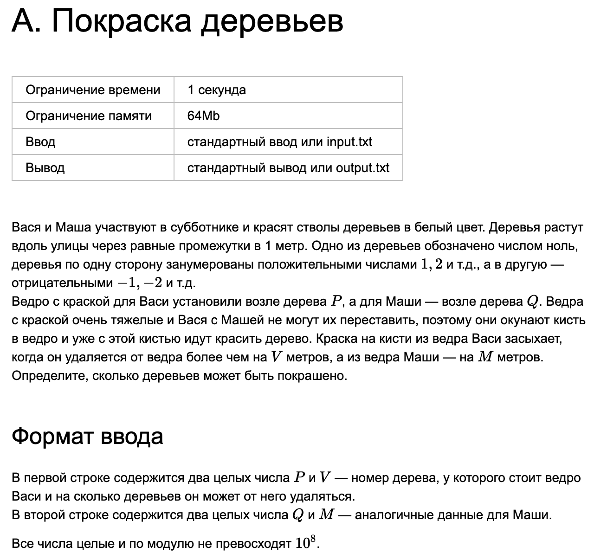
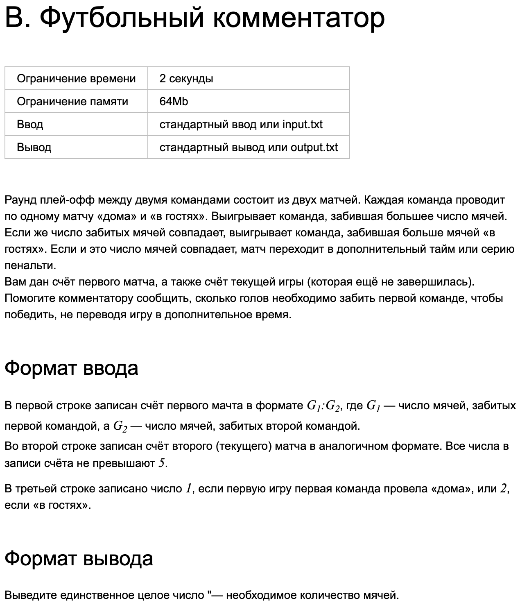
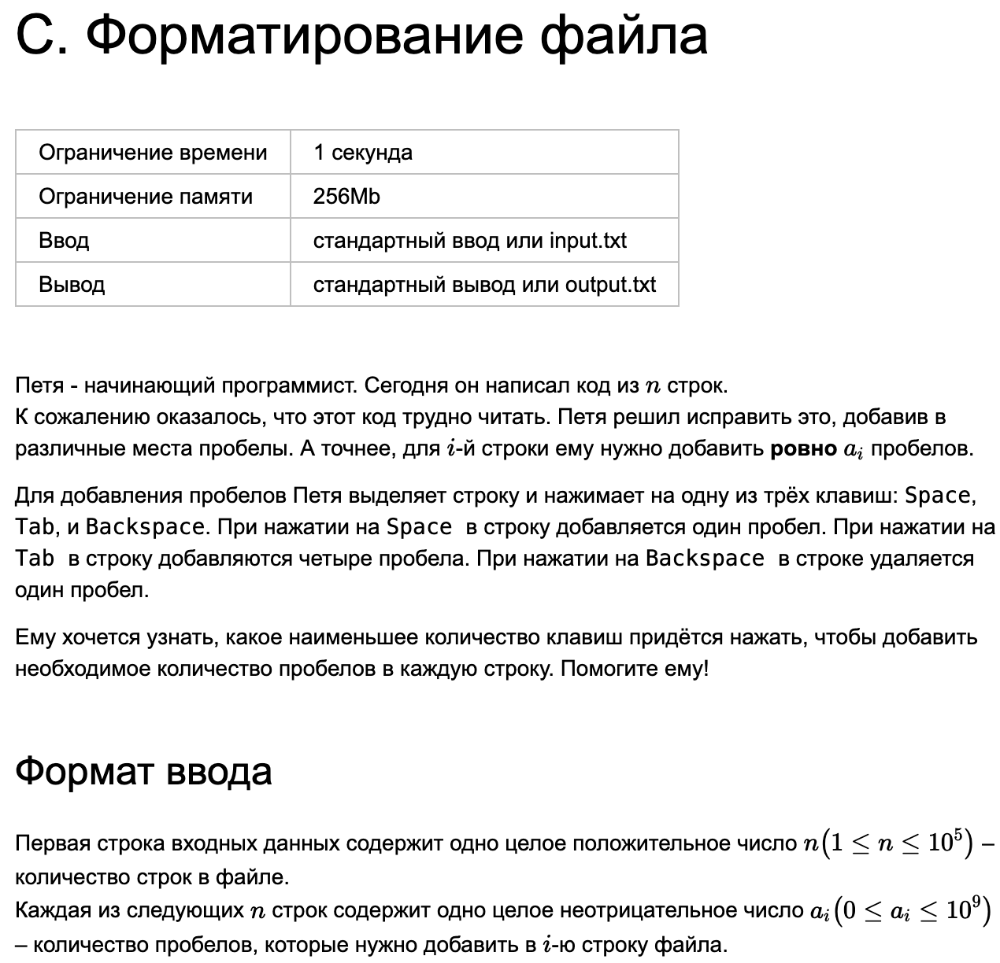
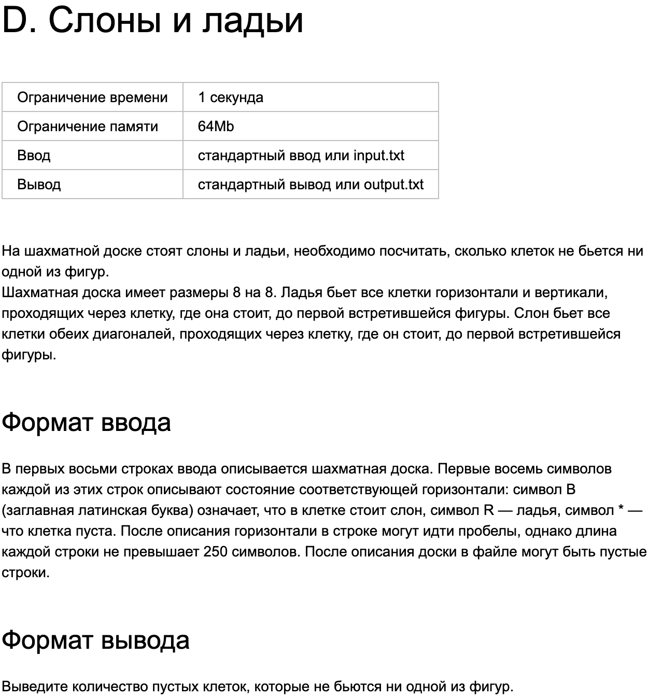

# Яндекс. Тренировки по алгоритмам 5.0
Тренировки по алгоритмам - это образовательное соревнование от Яндекса, нацеленное на образование и развитие в области алгоритмических задач. Участники получают возможность смотреть лекции по алгоритмическим темам, а также решать интересные и разнообразные задачи в домашних заданиях, тем самым развивая свои навыки программирования и алгоритмического мышления. Формат подходит как начинающим, так и более опытным участникам. 

Сами тренировки разбиты на 4 модуля, каждый посвящен отдельной теме и содержит по 10 задач. В данном репозитории представлены мои решения и соответсвующие идеи, которые помогли решить задачи.

## Содержание:

- [Модуль 1. Задача A](#модуль-1-задача-a)
- [Модуль 1. Задача B](#модуль-1-задача-b)
- [Модуль 1. Задача C](#модуль-1-задача-c)
- [Модуль 1. Задача D](#модуль-1-задача-d)

## [Модуль 1. Задача A](#модуль-1-задача-a)

В данном задании, полученные данные задают отрезки покрашенных деревьев для Васи и Маши. Основная сложность - это разобраться в пересечении этих отрезков, чтобы при подсчете общей покрашенной учесть все покрашенные деревья один раз. Нужно подумать о том, какие случая взаимного расположения могут быть. В общем случае может быть два случая - отрезки пересекаются или не пересекаются. Второй случай проще - нужно будет сложить соответсвующие отрезки (в решении - блок else). Первый же случай чуть сложнее. Так когда же отрезки будут пересекаться? На самом деле все просто - проверим, что минимальный правый отрезок будет больше максимального левого (|..[..|..]). А решение будет просто разница между максимальной правой границей и минимальной левой границей.

[Решение](Lesson_01/A/1A.cpp)

## [Модуль 1. Задача B](#модуль-1-задача-b)

Для начала определимся со случаями, которые возможны в данном задании. Первый случай - и в первой и во второй встречи мы ведем не менее чем на 1 гол. Тогда нам не важно, какая игра была дома, а какая в гостях - мы уже победили. Значит, нам необходимо забить ноль голов. Остаются случаи, когда игра равная или мы проигрываем. То есть разница голов за две игры между соперниками и нашей команды не менее 0. Если наша команда забьет эту разницу, то счет станет равный и победитель будет выбираться по результатам команд в качестве гостя. Если первая игра для нас была в качестве гостя (type=2), то нужно проверить, что за первую игру мы забили больше голов, чем соперники за другую. Если это так, то забить разницу нам будет достаточно, иначе нужен еще один гол. Аналогично для второго случая (type=1).

[Решение](Lesson_01/B/1B.cpp)

## [Модуль 1. Задача C](#модуль-1-задача-c)

В данной задаче применим жадную стратегию: покроем все пробелы с помощью tab. После этого у нас могут отстаться непокрытые пробелы (0, 1, 2 или 3). Определимся, что делать с ними. На самом деле все довольно просто. Если непокрытых пробелов не осталось, то ничего делать не надо. Остался 1 - нажмем клавишу SPACE. Осталось 2 - нажмешь SPACE дважды. Если же осталось 3 - то можно нажать TAB + BackSpace. 

[Решение](Lesson_01/C/1C.cpp)

## [Модуль 1. Задача D](#модуль-1-задача-d)

В данной задачи не требуется достичь хорошей асимптотической сложности. Достаточно просто сохранить все фигуры на поле - двумерном массиве. А после пройтись по всему полю и, встречая фигуры, во вложенном цикле отметить все допустимые ею ходы. После можно пройтись еще раз по всему полю и посчитать количество непокрытых клеток.

[Решение](Lesson_01/D/1D.cpp)